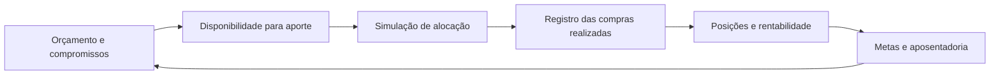
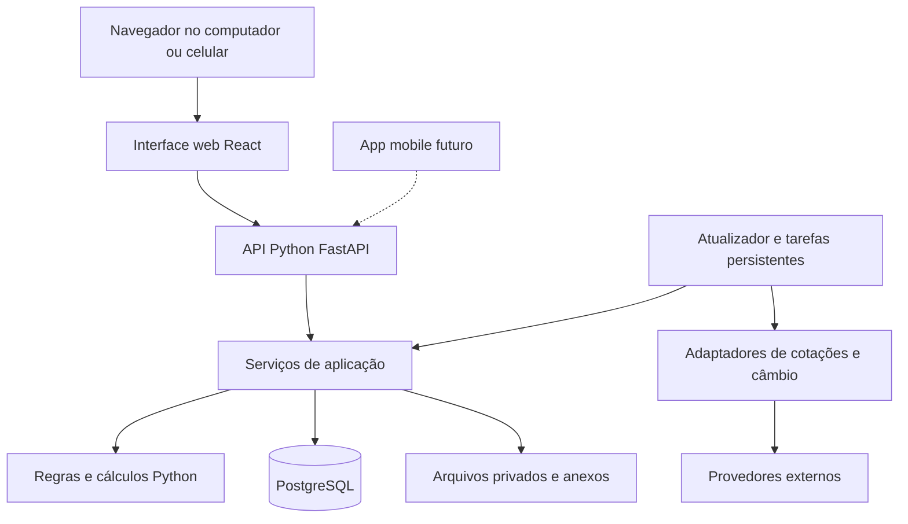
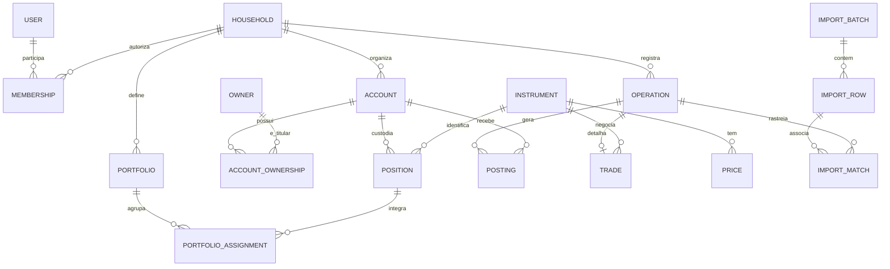
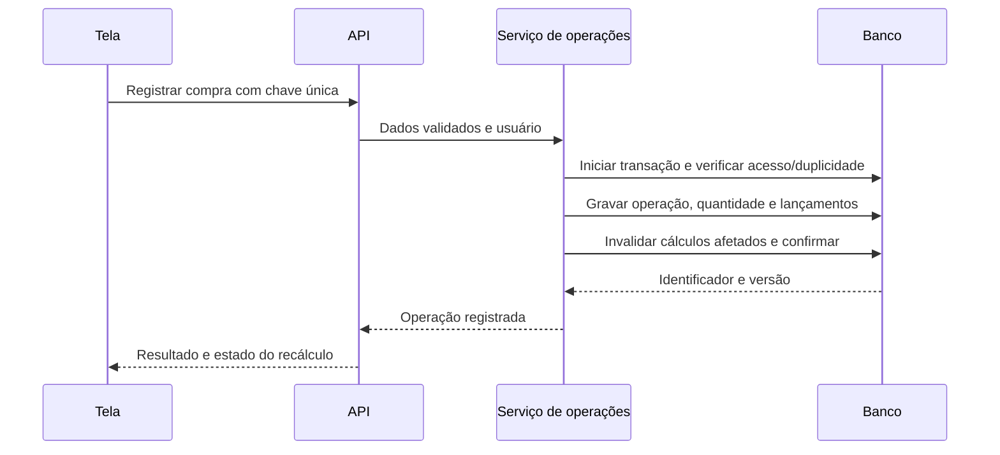
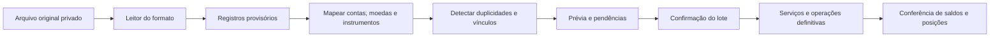
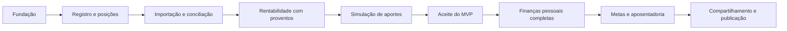

# Aplicativo integrado de finanças e investimentos

Especificação de produto, arquitetura e plano de implementação — versão 0.1, 13/09/2026.

**Estado:** proposta de implementação baseada nas respostas do proprietário, no código do Portfolio Tracker e na estrutura dos arquivos fornecidos. As escolhas recomendadas abaixo são decisões propostas, não funcionalidades já implementadas. Este documento não autoriza publicação, contratação de serviços ou movimentação financeira.

**Implementação atual:** a fundação técnica usa React, FastAPI, SQLAlchemy,
Alembic e PostgreSQL. Ela cobre carteiras, operações Buy/Sell, posições derivadas,
cotações e a importação local dos arquivos pickle originais. O restante deste
documento continua sendo proposta de produto; consulte `ARCHITECTURE.md` para a
arquitetura que existe no código.

## 1. Objetivo e decisões de escopo

Construir uma aplicação para registrar finanças pessoais, acompanhar investimentos globais, distribuir aportes conforme uma estratégia e monitorar objetivos de longo prazo. O primeiro resultado útil deve substituir o trabalho prioritário feito na planilha de investimentos; a etapa seguinte deve permitir substituir o Money Manager da Realbyte.

### 1.1 Requisitos confirmados

| Tema | Decisão do proprietário |
| --- | --- |
| Usuários | Uso individual inicialmente; futuramente, uso conjunto com a companheira |
| Possível distribuição | Comercialização ou código aberto no futuro; decisão ainda não tomada |
| Interface inicial | Web responsiva, acessível pelo navegador |
| Mobile e modo offline | Podem ficar para depois |
| Backend | Python, aproveitando a familiaridade do proprietário |
| Execução | Pode começar localmente, sem hospedagem paga |
| Desenvolvimento | Assistido por IA, com revisão do proprietário, que não tem experiência profissional em programação |
| Entrada de dados | Manual e importação dos históricos existentes |
| Investimentos | Abrangência internacional e múltiplas classes e moedas |
| Primeiras três entregas | Posições, rentabilidade da carteira com dividendos e cálculo de alocações |
| Apoio inicial ao IR | Quantidades, custo de aquisição e preço médio; contexto brasileiro |
| Finanças pessoais | Contas, receitas, despesas, transferências, imóveis, carros, empréstimos, cartões e orçamento mensal |
| Estratégia de alocação | Combinação de metas por indústria, setor, classe, país e outras dimensões |
| Metas | Incluir planejamento e acompanhamento da aposentadoria |

### 1.2 Recomendações adotadas nesta proposta

- Um backend e um banco, organizados em módulos. Interface web separada do cálculo financeiro.
- BRL como moeda inicial de apresentação, configurável; registros preservados também na moeda original.
- Uma pessoa titular e um espaço patrimonial no início. Estrutura preparada para múltiplos titulares e membros.
- Posições por conta de custódia e instrumento; carteiras são agrupamentos lógicos explícitos.
- Alocação inicial apenas com dinheiro disponível, sem vendas sugeridas ou execução automática de ordens.
- Cotações diárias, atualização manual sob demanda e alternativa de entrada/importação de preços.
- Metas de alocação multidimensionais tratadas como objetivos com pesos e tolerâncias, pois nem sempre são simultaneamente atingíveis.
- Histórico completo preservado na importação, com lacunas identificadas; sem fabricar operações para fazê-lo fechar.
- Sem integração bancária automática, IA classificadora ou aplicativo nativo no MVP.

“Todos os investimentos” define a direção do produto, não uma promessa de que todo contrato financeiro estará automatizado na primeira versão. O cadastro será extensível; cada tipo terá um nível explícito de suporte, descrito na seção 7.

### 1.3 O que significa terminar

**Marco A — MVP de investimentos:** importar e conferir o histórico necessário, consultar posições, medir resultado com proventos e simular aportes com limites definidos. Ainda não substitui todas as funções do Money Manager.

**Marco B — substituição do Money Manager:** importar e conciliar seu histórico financeiro, registrar operações do dia a dia, acompanhar cartões, dívidas, bens e orçamento mensal.

**Marco C — planejamento integrado:** relacionar orçamento, disponibilidade para aporte, metas e aposentadoria, mantendo previsto e realizado separados.

## 2. Páginas e funcionalidades

As páginas abaixo são o mapa do produto final. A coluna de marco evita construir toda a interface antes de validar os cálculos.

| ID / página | Objetivo e informações | Ações e estados principais | Marco |
| --- | --- | --- | --- |
| UI-01 Início | Resumo da carteira, caixa de investimentos, resultado, alocação e qualidade dos dados; depois, visão patrimonial total | Escolher período, moeda e carteira; distinguir ausência de dados de saldo zero | A; ampliar em B |
| UI-02 Posições | Quantidade, custo, preço médio, cotação, valor atual, ganhos e exposição | Filtrar por titular, conta, classe, país e moeda; consultar posição em uma data; abrir memória de cálculo | A |
| UI-03 Detalhe do investimento | Identificação, posições por conta, operações, proventos e histórico de preços | Registrar operação, corrigir identificação, revisar cotação; indicar suporte manual | A |
| UI-04 Operações | Compras, vendas, eventos e movimentações vinculadas ao caixa | Criar, revisar, corrigir e estornar; anexar documento; mostrar execução e liquidação | A |
| UI-05 Proventos | Dividendos, juros e outros rendimentos confirmados e previstos | Registrar valores bruto, retido e líquido; confirmar recebimento; evitar duplicação por importação | A |
| UI-06 Rentabilidade | Resultado monetário e retorno percentual por período, incluindo rendimentos | Escolher carteira e moeda; ver aportes separados do resultado; identificar metodologia e cobertura histórica | A |
| UI-07 Alocação e aportes | Exposição atual, metas, desvios e proposta de compras | Definir estratégia; informar aporte e contas disponíveis; simular; ajustar; salvar proposta sem alterar posições | A |
| UI-08 Importações | Histórico de arquivos, prévia, mapeamentos, pendências e conciliação | Carregar arquivo, mapear contas/instrumentos, revisar duplicidades, confirmar lote e desfazer de forma controlada | A; ampliar em B |
| UI-09 Contas | Contas bancárias e de corretora, moedas e saldos | Criar conta, registrar transferência, definir saldo inicial e conciliar | Caixa de investimentos em A; completo em B |
| UI-10 Movimentações pessoais | Receitas, despesas, categorias e compromissos | Lançar, categorizar, pesquisar, programar recorrência e registrar realização | B |
| UI-11 Cartões e faturas | Compras, parcelas, fechamento, vencimento e dívida | Cadastrar cartão, revisar fatura, pagar parcialmente ou integralmente, registrar juros | B |
| UI-12 Orçamento mensal | Orçado, realizado e comprometido por categoria | Definir limites e revisar diferenças; escolher critério de competência ou caixa | B |
| UI-13 Bens e dívidas | Imóveis, veículos, avaliações, empréstimos e saldos devedores | Registrar avaliação e fonte; discriminar principal, juros e pagamento | B |
| UI-14 Patrimônio | Ativos menos passivos, composição e série histórica | Separar visão individual e conjunta; mostrar valor de mercado e custo em visões próprias | B |
| UI-15 Metas e aposentadoria | Recursos destinados, evolução, premissas, plano original e revisões | Criar meta, vincular recursos, simular cenários e comparar projetado com realizado | C |
| UI-16 Relatórios e exportação | Posições em data de corte, custos, movimentos e resultados | Exportar CSV; relatório de conferência anual; mostrar titular e moeda de cada resultado | A; ampliar em B/C |
| UI-17 Configurações | Moedas, titulares, instituições, categorias, classificações e fontes | Ajustar preferências, exportar backup e consultar última restauração testada | A |
| UI-18 Acesso e compartilhamento | Sessão do usuário e permissões do espaço patrimonial | Entrar e sair; futuramente convidar membros e compartilhar espaços | Um usuário em A; compartilhamento depois |

### 2.1 Fluxo principal do produto



As setas representam informações usadas no planejamento. Elas não criam lançamentos automaticamente: aprovar uma simulação não significa que a compra aconteceu. O MVP pode começar com o valor disponível informado manualmente; o orçamento passa a calculá-lo no marco C.

### 2.2 Padrões da experiência

- Termos em português, valores e datas no formato local; filtros de moeda e data sempre visíveis em relatórios.
- Cada número calculado importante permite abrir sua composição, fonte e data de atualização.
- Dado ausente, desatualizado, estimado ou não suportado recebe indicação específica, sem virar zero silenciosamente.
- Tabelas extensas devem oferecer filtros, paginação e exportação. No celular, priorizar resumo e detalhe por item.
- Resultados planejados não se misturam aos realizados. Operações importadas pendentes não afetam saldos.
- Exclusões de cadastros com histórico são substituídas por arquivamento. Correções preservam a trilha anterior.

## 3. Arquitetura explicada

### 3.1 Visão geral

Imagine um sistema de engenharia: a interface é o painel de operação; a API é a conexão padronizada; os serviços coordenam a operação; os cálculos são o modelo matemático; o banco guarda os registros de medição e execução.



**Monólito modular:** um projeto de backend, com módulos internos bem separados. Não exige vários serviços de rede para contas, investimentos e metas. As rotinas agendadas podem rodar em outro processo reutilizando o mesmo código e o mesmo banco.

**API:** conjunto de operações que a interface pode solicitar, como “registrar compra” e “consultar posições”. O futuro app mobile usa essas mesmas operações, sem copiar as regras financeiras.

**Serviço de aplicação:** coordena validação, permissão, gravação e cálculo. É responsável por garantir que as partes de uma operação sejam registradas juntas.

**Núcleo de cálculo:** funções Python que recebem dados e devolvem resultados. Não fazem chamadas ao Yahoo Finance nem dependem de uma tela aberta.

### 3.2 Módulos internos

| Módulo | Responsabilidade | Dependências permitidas |
| --- | --- | --- |
| Identidade | Usuários, titulares, espaços patrimoniais, participação e acesso | Infraestrutura comum |
| Registro financeiro | Operações, lançamentos, caixa e trilha de correções | Identidade e moedas |
| Investimentos | Operações com instrumentos, posições, custo e eventos | Registro financeiro e dados de mercado |
| Dados de mercado | Instrumentos, identificadores, preços, câmbio e eventos publicados | Adaptadores externos e persistência |
| Desempenho | Avaliações e rentabilidade | Posições, caixa, fluxos e preços |
| Alocação | Metas de exposição e simulações | Posições, preços e classificações |
| Finanças pessoais | Categorias, cartões, orçamento, bens e dívidas | Registro financeiro |
| Planejamento | Metas, aposentadoria, projeções e versões de premissas | Consultas de patrimônio e orçamento |
| Importação | Ler, normalizar, revisar e conciliar arquivos | Serviços dos módulos donos dos registros |

A importação chama os mesmos serviços usados pelo formulário manual. Assim, não cria um segundo caminho com regras diferentes. O banco é compartilhado, mas cada módulo controla as alterações de seus registros.

### 3.3 Ferramentas propostas

| Ferramenta | Função e justificativa | Quando |
| --- | --- | --- |
| Python em versão estável compatível | Linguagem do backend; fixar uma versão testada, não simplesmente a instalada mais recente | Fundação |
| FastAPI + Pydantic | API e validação dos dados de entrada e saída, com descrição OpenAPI | Fundação |
| SQLAlchemy | Traduzir os registros Python para tabelas, com uma base comum de modelos | Fundação |
| Alembic | Registrar cada alteração do banco como uma migração versionada | Fundação |
| PostgreSQL | Banco único local e futuro servidor; dados relacionais e precisão numérica | Fundação |
| React + TypeScript + Vite | Interface web responsiva; TypeScript ajuda a detectar contratos incompatíveis | Primeiro fluxo web |
| Biblioteca de gráficos | Selecionar após protótipo de série temporal e exposição; avaliar licença, acessibilidade e desempenho | Rentabilidade |
| pytest | Verificar regras financeiras e integração de banco com exemplos controlados | Desde os cálculos iniciais |
| Ruff e verificação de tipos | Detectar problemas simples e manter consistência no código Python | Fundação |
| Playwright | Verificar poucos fluxos completos pelo navegador | Primeiro fluxo completo |
| Docker Compose | Subir banco e serviços com configuração reproduzível; banco nativo é alternativa se Docker não for viável na máquina | Fundação |
| Git | Histórico do código e das decisões; dados financeiros ficam fora do repositório | Desde o início |
| Adaptador de planilhas | Leitura sem executar fórmulas; biblioteca escolhida na implementação conforme formatos reais | Importação |

FastAPI oferece OpenAPI e validação integrada: [documentação](https://fastapi.tiangolo.com/features/). Alembic gerencia migrações SQLAlchemy: [documentação](https://alembic.sqlalchemy.org/en/latest/). Vite fornece o ambiente de desenvolvimento e construção do frontend: [documentação](https://vite.dev/guide/). Compose organiza aplicações com vários contêineres: [documentação](https://docs.docker.com/compose/).

Não há necessidade inicial de Kubernetes, microserviços, Redis, fila distribuída ou dois bancos. Uma tabela de tarefas com estado, tentativas, progresso e retomada atende as primeiras importações e atualizações demoradas. A durabilidade dessas tarefas não deve depender da vida de uma requisição HTTP.

### 3.4 Estrutura sugerida do repositório

```text
backend/
  app/
    main.py
    common/              # Configuração, tipos Money e Quantity, banco
    identity/
    ledger/
    investments/
    market_data/
    performance/
    allocation/
    personal_finance/
    planning/
    imports/
  migrations/
  tests/
frontend/
  src/
docs/
  requisitos-arquitetura-roadmap.md
  decisions/
```

Um módulo pode conter `routes.py` para API, `schemas.py` para contratos, `services.py` para coordenação, `models.py` para persistência e `calculations.py` para matemática. Criar esses arquivos apenas quando houver responsabilidade real. Não duplicar cada entidade em muitas camadas sem necessidade.

Arquivos importados, anexos, backups e banco devem ficar em uma pasta privada configurável fora do repositório. Exemplos usados em testes devem ser sintéticos ou anonimizados.

### 3.5 Execução local e evolução

Inicialmente, navegador, API e banco podem estar no mesmo computador. Preferir acesso por `localhost`, com um usuário e sessão autenticada. O frontend pode ser servido pela mesma origem da API, simplificando sessões por cookie e proteção contra requisições indevidas.

Rodar localmente não equivale a implementar modo offline em vários dispositivos. Cotações externas ainda exigem internet; sem rede, o app usa dados armazenados e informa a atualização mais recente.

Para celular acessar pela rede local, será necessário configurar acesso e transporte seguro; isso não deve ser obtido expondo o servidor de desenvolvimento indiscriminadamente. Para publicação futura: HTTPS, gestão de segredos, restauração de backup, monitoramento, permissões entre usuários e revisão de dependências são critérios de entrada.

Não existe orçamento de hospedagem aprovado. Esta proposta não depende de serviços pagos. Recursos e requisitos de máquina devem ser medidos na fundação; preços de nuvem e fornecedores só serão comparados quando houver decisão de hospedagem.

## 4. Arquitetura dos dados

### 4.1 Conceitos fundamentais

| Conceito | O que representa | O que não deve ser confundido |
| --- | --- | --- |
| Usuário | Pessoa que entra no aplicativo | Titular fiscal de todo dinheiro que consegue visualizar |
| Espaço patrimonial | Conjunto de dados com regras de acesso, individual ou compartilhado | Uma conta bancária |
| Titular | Pessoa ou entidade proprietária de uma conta ou bem | Papel de editor/leitor |
| Conta | Local de caixa, custódia ou obrigação, ligado a uma instituição | Cadastro de uma ação |
| Instrumento | Identidade de um investimento ou contrato financeiro | Quantidade que uma pessoa possui |
| Posição | Quantidade e custo por conta e instrumento em determinada data | Cotação do instrumento |
| Carteira | Agrupamento lógico usado para análise | Uma cópia adicional da posição |
| Operação | Fato econômico, como compra, recebimento ou transferência | Simulação ou intenção |
| Lançamento | Uma das partes monetárias ou patrimoniais da operação | Uma transação independente sem vínculo com as demais |
| Avaliação | Valor de um recurso em uma data, com fonte | Custo de aquisição |
| Meta | Objetivo e destinação de recursos | Nova conta ou dinheiro adicional |

Recomendação de compartilhamento: começar com um espaço pessoal. Depois permitir outro espaço pessoal e um compartilhado, com consolidação dos espaços autorizados. Cada conta pertence a um espaço; a consolidação não duplica contas. Permissões iniciais por espaço são mais simples do que regras diferentes para cada campo.

### 4.2 Diagrama principal



`||` significa “um”; `o{` significa “zero ou vários”. Exemplo: uma operação pode produzir vários lançamentos. O desenho é conceitual; tabelas auxiliares de moedas, classificações, documentos e controle não estão todas representadas.

No MVP, uma posição inteira integra no máximo uma carteira operacional por período. Visões agregadas podem reuni-las sem copiar posições. Divisão parcial entre estratégias requer frações explícitas e validação para que a soma não exceda 100%; ficará para evolução.

### 4.3 Entidades, parâmetros e regras

| Entidade | Campos principais propostos | Regras |
| --- | --- | --- |
| `Household` | `id`, nome, moeda de apresentação, fuso | Todo dado privado pertence a um espaço |
| `Membership` | usuário, espaço, papel | Dono/editor/leitor; autorização também em relatórios, anexos e tarefas |
| `Owner` / `AccountOwnership` | titular, conta, participação, início/fim da vigência | Propriedade separada de acesso; participações válidas somam 100% |
| `Account` / `AccountBalance` | instituição, tipo, titularidade, moeda por subconta, arquivamento | Conta multimoeda usa saldos separados por moeda |
| `Instrument` | tipo, nome, mercado, moeda, unidade, precisão, nível de suporte | Não contém quantidade ou custo pessoal; ticker isolado não é identificador universal |
| `InstrumentIdentifier` | instrumento, fonte, identificador, vigência | Diferentes provedores podem usar símbolos diferentes |
| `Operation` | tipo, datas, sequência, estado, origem, chave de idempotência, versão, correção vinculada | Confirmada uma vez; sequência estável para fatos no mesmo instante |
| `Posting` | operação, conta contábil/subconta, moeda/unidade, valor com sinal, valor de registro, data efetiva | Partes da operação gravadas juntas e reconciliáveis |
| `Trade` | instrumento, conta, compra/venda, quantidade, preço, custos, datas, documento | Valores positivos; vendas superiores ao saldo rejeitadas no suporte básico |
| `CorporateAction` | instrumento, tipo, datas, fator/valor, moeda, fonte | Separar evento publicado de direito do titular e recebimento efetivo |
| `IncomeEntitlement` | posição/titular, evento, quantidade elegível, bruto, retido, líquido, datas, estado | Um recebimento não pode ser contado novamente como nova renda importada |
| `PositionSnapshot` / `CostBalance` | conta, instrumento, data, quantidade, custo, moeda, versão do cálculo | Resultado reconstruível; custo fiscal pode usar agrupamento diferente da posição operacional |
| `Price` | instrumento, instante/data, preço, moeda, fonte, ajustes | Chave por fonte e tipo; saber se preço foi ajustado por proventos e eventos |
| `ExchangeRate` | moeda origem/destino, taxa, data, fonte, finalidade | Explicitar a direção da taxa e preservar a origem histórica |
| `Classification` / `Exposure` | dimensão, categoria, instrumento, peso, vigência, fonte | Dentro de uma dimensão, pesos válidos somam 100%, incluindo “não classificado” |
| `AllocationPolicy` | carteira, versão, vigência, dimensão, meta, tolerância, prioridade | Metas por dimensão; classes e setores não formam uma única soma |
| `AllocationSimulation` | aporte, moedas/contas, preços usados, política, restrições, propostas, sobra | Rascunho imutável após salvar; não gera ordem financeira |
| `ImportBatch` / `ImportRow` | hash, formato, versão do leitor, linha, estado, erros, dados originais privados | Preservar origem; confirmação explícita e relatório de conciliação |
| `ImportMatch` | linha de origem, operação destino, decisão, motivo | Permitir unir evidências de dois arquivos à mesma operação |
| `Budget` / `RecurringCommitment` | mês, categoria, valor, moeda, competência, vencimento, estado | Programado não altera saldo realizado |
| `CardStatement` / `Installment` | cartão, período, fechamento, vencimento, compra, parcela, pagamento | Compra gera despesa/obrigação conforme política; pagar fatura não gera segunda despesa |
| `Property` / `Valuation` | bem, titular, tipo, avaliação, data e fonte | Imóvel e carro avaliados separadamente das dívidas que os financiam |
| `Loan` / `LoanPayment` | principal, moeda, contrato, saldo, principal pago, juros, encargos | Principal reduz obrigação; juros/encargos são componentes separados |
| `Goal` / `GoalFunding` | valor/data alvo, moeda, recursos/frações, prioridade | Não destinar mais de 100% do mesmo recurso a metas exclusivas |
| `RetirementPlan` / `Scenario` | início, aposentadoria, horizonte, renda, aportes, inflação, retornos, outras rendas | Premissas versionadas; resultados nominais e reais identificados |

Para renda fixa, fundos e contratos, adicionar detalhes próprios, como emissor, vencimento, indexador, cotas e fluxo previsto. Não criar dezenas de colunas opcionais na classe base nem tratar um contrato complexo apenas como ticker.

### 4.4 Precisão, tempo e preservação

- Usar `Decimal` em Python e `Numeric` no banco; precisão inicial sugerida de 28 dígitos com 12 casas para quantidades, preços e câmbio, revisada pelos instrumentos suportados. Moedas têm arredondamento de apresentação próprio. O PostgreSQL recomenda `numeric` para valores que exigem exatidão: [documentação](https://www.postgresql.org/docs/16/datatype-numeric.html).
- Em contratos JSON, transmitir decimais como texto para não depender da aproximação numérica do navegador.
- Guardar datas de operação, liquidação e competência separadamente. Instantes de auditoria em UTC; data de negociação usa o calendário apropriado.
- Não substituir cotação ausente por zero. Última cotação conhecida pode ser usada com idade e regra explícitas; acima do limite configurado, marcar avaliação incompleta.
- Correção de evento passado invalida os resultados dependentes desde a primeira data afetada. Guardar versão da metodologia e origem dos dados em fechamentos.
- Backup inclui banco, anexos e mapeamentos de importação. Testar restauração em base separada antes de abandonar as fontes antigas.

### 4.5 Operações e consistência

Usar um registro financeiro com lançamentos balanceados e unidades explícitas. A interface mostra “compra”, “despesa” e “transferência”; detalhes contábeis ficam na memória de cálculo.

Exemplo fictício de compra sem custos: retirar R$ 1.000 do caixa para adquirir uma posição com custo de R$ 1.000 não cria despesa de consumo nem aumenta o patrimônio pela transferência. A avaliação posterior da posição pode divergir desse custo.

Exemplo de venda: baixar R$ 800 de custo e receber R$ 1.000 exige registrar R$ 200 de resultado, além da saída da quantidade. Compra e venda não são apenas duas transferências simétricas.

Liquidação posterior usa uma conta transitória a pagar/receber. A exposição surge na operação; o caixa muda na liquidação. Na conversão de moedas, manter as duas quantias originais, a taxa efetiva, custos e contrapartidas de conversão. Não somar USD com BRL para testar equilíbrio.

O agrupamento contábil em moeda de registro é diferente da avaliação em moeda de apresentação e do tratamento fiscal. Conversão, arredondamento e eventual diferença devem ser explícitos.



Se qualquer gravação falhar, a transação do banco desfaz o conjunto. Repetir a mesma solicitação não deve registrar a compra duas vezes. Compras/vendas concorrentes precisam de bloqueio ou controle de versão por posição.

## 5. Métodos de cálculo e parâmetros

Os métodos abaixo especificam comportamento de software. Não definem recomendação de investimento, premissas pessoais de retorno ou regras tributárias universais.

### 5.1 Quantidades e custo

Para o método de custo médio suportado inicialmente, em uma compra:

```text
quantidade_nova = quantidade_anterior + quantidade_comprada
custo_novo = custo_anterior + valor_compra + custos_incorporáveis
preço_médio = custo_novo / quantidade_nova
```

Em venda parcial, baixar a quantidade vendida pelo custo médio anterior; o recebimento líquido menos o custo baixado produz o resultado realizado. Ao zerar a posição, ajustar apenas resíduos documentados de arredondamento. Um desdobramento altera quantidade e preço unitário, preservando o custo total, salvo componentes distintos do evento.

“Custos incorporáveis” é uma política explícita por finalidade e tipo de instrumento. Saldo operacional por conta e agrupamento para relatórios de custo não devem ser confundidos: a política brasileira aplicável deve ser verificada antes de rotular o relatório como fiscal. Nesta etapa, não calcular DARF nem prometer declaração pronta.

Moedas: preservar custo na moeda do instrumento e valores históricos de conversão com finalidade e fonte. Não reavaliar custo histórico usando câmbio atual. Data e fonte exigidas para finalidade fiscal ficam parametrizadas e dependem de validação específica.

### 5.2 Valor de mercado e proventos

```text
valor_posição = quantidade × preço_na_data
valor_convertido = valor_posição × taxa_de_conversão_na_data
patrimônio_líquido = ativos_avaliados − passivos
```

Dividendos recebidos entram no caixa. Reinvestimento gera uma compra separada vinculada; não registrar o mesmo dividendo como renda duas vezes. Para a carteira que inclui esse caixa, o dividendo é rendimento interno, não aporte do investidor.

Preferir preços sem ajuste por dividendos ao combiná-los com dividendos explícitos. Metadados do provedor devem indicar ajustes por splits e proventos para evitar dupla contagem. Não assumir que a configuração padrão do fornecedor serve para o cálculo.

No MVP, suportar recebimentos confirmados e identificar a metodologia por caixa. Quando houver datas e quantidades elegíveis confiáveis, suportar direito a receber desde a data do evento e baixa no pagamento. Sem esses dados, não apresentar o retorno diário como metodologia por competência.

### 5.3 Rentabilidade

**Fronteira da análise:** cada relatório declara quais contas e posições fazem parte da carteira. Compra interna entre caixa e investimento não é aporte. Transferência do banco pessoal para uma carteira pode ser aporte para essa carteira e transferência interna para o patrimônio total.

Entregar primeiro resultado em dinheiro e retorno diário encadeado com uma convenção de fluxo explícita:

```text
resultado_período = valor_final − valor_inicial − aportes_externos + retiradas_externas
```

Os valores incluem caixa e os direitos/obrigações contemplados pela metodologia escolhida. Resultado já refletido no caixa não é somado novamente.

Para a aproximação diária inicial, convencionar fluxos externos no fim do dia:

```text
r_dia = (valor_final_dia − fluxo_externo_líquido_dia) / valor_inicial_dia − 1
retorno_acumulado = produto(1 + r_dia) − 1
```

Valor inicial zero, carteira vazia, fluxo que inviabilize o denominador ou patrimônio negativo não produz retorno percentual automático. Começar o encadeamento na primeira avaliação válida após a capitalização; informar intervalos sem cobertura. Não substituir percentual indefinido por 0%.

Rotular esse cálculo como aproximação diária com fluxos no fechamento. Para TWR com avaliação em cada fluxo, dividir o período nos instantes de aportes/retiradas e encadear os retornos. A metodologia de encadeamento é descrita no [GIPS Handbook](https://www.gipsstandards.org/standards/gips-standards-for-firms/gips-standards-handbook-for-firms/); usar a referência não implica certificação ou conformidade GIPS do aplicativo.

Na evolução, adicionar retorno ponderado pelo dinheiro, calculado a partir das datas dos fluxos e valor terminal, para responder à experiência do investidor. Não esconder ausência de solução ou múltiplas soluções possíveis.

Comparações futuras: índices com metodologia compatível, período e moeda alinhados, retorno total versus retorno de preço identificados. Inflação, volatilidade, maior queda e efeito cambial entram depois da validação do retorno básico. Não calcular retorno da carteira pela média simples dos percentuais dos ativos.

### 5.4 Alocação multidimensional

Parâmetros: recursos disponíveis por conta/moeda; universo de instrumentos; preços e validade; passo de quantidade; compra mínima; custos; metas, prioridades e tolerâncias por dimensão; ativos bloqueados; reserva mínima; permissão explícita para conversão de moeda.

Um instrumento pode contribuir simultaneamente para “ações”, “Estados Unidos” e “tecnologia”. São dimensões diferentes. Um ETF pode receber exposição agregada manual inicialmente; análise automática de sua composição fica para depois.

Para cada categoria `c` de uma dimensão:

```text
exposição_c = soma(valor_instrumento × fração_exposta_a_c)
peso_c = exposição_c / valor_total_do_universo
desvio_c = peso_c − meta_c
```

Setor e indústria podem ser níveis da mesma hierarquia. Validar coerência entre metas de pais e filhos; não tratar todas como limites rígidos independentes. Um instrumento sem classificação permanece no denominador e aparece como “não classificado”.

Objetivo proposto: reduzir a soma ponderada dos desvios quadráticos entre exposição final e metas. Pesos expressam a prioridade do usuário; restrições rígidas representam caixa, quantidades, bloqueios e limites de gasto.

Implementação inicial: algoritmo determinístico e incremental, comprando lotes ou incrementos permitidos que melhorem o objetivo enquanto houver caixa, com limite de iterações. Mostrar que é uma solução aproximada, os desvios restantes e a sobra. Não prometer ótimo global; aportes pequenos e restrições podem impedir atingir a meta. Solução matemática mais sofisticada só entra se exemplos reais mostrarem necessidade.

O dinheiro já presente na carteira e um aporte externo não podem entrar duas vezes no denominador. Definir se a reserva excluída está fora do universo de alocação. Sem conversão autorizada, saldo em BRL não financia compra em USD.

### 5.5 Orçamento e aposentadoria

Orçamento: adotar inicialmente competência das parcelas para categorias e caixa para previsão de saldos. Mostrar as duas visões com nomes distintos. Pagamento de fatura liquida dívida; não repete a despesa das compras. Entrada de empréstimo aumenta caixa e passivo; não é salário.

Disponibilidade para aporte: caixa elegível menos compromissos no horizonte escolhido menos reserva definida. O usuário pode ajustar a proposta, mas o ajuste não altera saldos. Não deduzir a mesma compra uma vez como parcela e outra como fatura na previsão.

Aposentadoria: começar com projeção mensal determinística de acumulação e retiradas, sem probabilidade de sucesso. Entradas: recursos elegíveis, data alvo, horizonte de vida do plano, aportes, renda desejada, outras rendas, inflação, retorno, custos e tratamento estimado de impostos. Valores são premissas do usuário; não inserir taxas “seguras” por padrão.

```text
taxa_mensal = (1 + taxa_anual)^(1/12) − 1
saldo_fim_mês = saldo_início_mês × (1 + retorno_mensal)
                + aporte_fim_mês − retirada_fim_mês
valor_real = valor_nominal / fator_acumulado_de_inflação
```

Renda externa reduz a retirada necessária; não somá-la também como aporte, salvo escolha explícita. Comparar cenários conservador/base/favorável e preservar plano original e revisões. Identificar se retornos são brutos/líquidos e nominais/reais para evitar descontar inflação ou custos duas vezes.

O patrimônio necessário pode ser obtido por busca numérica do saldo inicial que atende às retiradas no horizonte e ao saldo terminal desejado. A fórmula de renda dividida por rendimento, presente na planilha, pode ser uma referência simplificada, mas não cobre sozinha um plano com horizonte, inflação e consumo de principal. Simulação estocástica e risco de sequência ficam para evolução.

## 6. Importação e migração dos históricos

### 6.1 Fontes examinadas

| Fonte | Evidência observada | Uso na migração |
| --- | --- | --- |
| Código do Portfolio Tracker | Migração incompleta de objetos/listas para SQLAlchemy; consultas de mercado dentro dos modelos; testes financeiros não estabelecidos | Referência de conceitos e cálculo; refatoração necessária |
| `Controle de Investimentos_v2.0.xlsx` | Abas Transactions, Posições, Evolução, Plano Aposentadoria e auxiliares; moeda original/local; fórmulas com funções Google Sheets encapsuladas | Operações e premissas como fonte; resultados como referências a conferir, sem executar fórmulas na importação |
| `Backup.xlsx` do Money Manager | Uma aba `Money Manager_2-19-26`; 2.064 registros de dados e cabeçalho | Importação financeira em staging, seguida de mapeamento e conciliação |

A exportação fornecida foi examinada como dados, não como instruções para o aplicativo. Não foi modificada, importada no banco nem auditada integralmente. Nenhum valor pessoal, nome de conta particular ou descrição de compra foi copiado para esta especificação.

### 6.2 Estrutura observada do backup Money Manager

| Coluna | Cabeçalho | Tratamento proposto |
| --- | --- | --- |
| A | Date | Há serial de data Excel e texto `MM/DD/YYYY HH:MM:SS`; respeitar o sistema de datas do arquivo e não inferir DD/MM por idioma |
| B | Account | Nome da conta de origem; mapear para identificador interno e titular |
| C | Category | Categoria em receitas/despesas; em transferências, candidata a referência de destino, ainda sujeita à validação |
| D | Subcategory | Preservar estrutura opcional; sem valores de dados no exemplo examinado |
| E | Note | Texto original; indicação textual de parcela não basta para inventar cronograma completo |
| F | BRL | Valor exportado em BRL; guardar como representação da fonte, não assumir cotação fiscal |
| G | Income/Expense | Tipos observados: `Income`, `Expense`, `Transfer-Out` |
| H | Description | Descrição opcional |
| I | Amount | Quantia original, a ser relacionada à moeda de J |
| J | Currency | BRL e USD observados; modelo não limitado a essas moedas |
| K | Account | Apesar do cabeçalho repetido, contém números; finalidade precisa de confirmação, não mapear como nome de conta |

Contagens estruturais observadas: 1.409 despesas, 217 receitas e 438 transferências de saída. Datas: 890 numéricas e 1.174 textuais. Há 17 nomes distintos na coluna B. Em 389 das 438 transferências, a categoria coincide com algum nome de conta em B; isso é evidência de possível destino, não prova suficiente para criar contrapartida automaticamente. Os 49 casos restantes podem envolver contas não presentes como origem, outra convenção ou dados incompletos.

As colunas I e K coincidem em 2.046 registros e diferem em 18. Preservar ambas; confirmar sua semântica com exemplos de transferência e conversão no aplicativo original. O arquivo não apresenta coluna de identificador estável, nem prova por si só conter configurações de orçamento, saldos de abertura, contratos, anexos ou todas as faturas.

O produto existente foi identificado como Money Manager Expense & Budget, da Realbyte. A página oficial descreve exportação/backup Excel e recursos de orçamento, cartões e transferências, mas não fornece contrato detalhado desse arquivo: [Google Play](https://play.google.com/store/apps/details?id=com.realbyteapps.moneymanagerfree&hl=en).

### 6.3 Fluxo de importação



Regras de importação:

1. Guardar hash do arquivo, versão do leitor, aba e linha. Detectar reenvio idêntico antes de processar.
2. Normalizar datas, decimais e moedas sem avaliar fórmulas, links externos ou texto como código.
3. Em arquivos parcialmente sobrepostos, usar impressão composta como candidata a duplicidade, não identidade absoluta: duas compras iguais podem ser legítimas. Considerar multiplicidade, origem e decisão de revisão.
4. Mapear cada conta e instrumento uma vez, reutilizando o mapeamento em lotes posteriores.
5. Transferência confirmada gera uma operação com contrapartidas; não importar duas despesas. Não inferir destino ambíguo sem revisão.
6. Cruzar a planilha de investimentos com movimentos da corretora no backup. Um débito de compra ou crédito de dividendo pode já existir em ambos; vincular as evidências à mesma operação.
7. Proventos agregados no backup sem instrumento identificado podem entrar como recebimento pendente de classificação; não atribuir a um ticker arbitrário.
8. Apresentar incluídos, associados a registros existentes, pendentes e rejeitados, com motivo e totais por conta/moeda.
9. Confirmar lotes em unidade transacional ou blocos reiniciáveis explicitamente rastreados. Lote parcial não pode parecer concluído.
10. Desfazer lote só remove registros sem dependências posteriores; quando houver dependências, produzir correções/estornos e recálculo, mantendo o histórico.

### 6.4 Condição para abandonar planilha e aplicativo antigos

- Quantidades e custos conferidos por instrumento/titular e por datas de corte relevantes.
- Saldos iniciais e finais por conta/moeda conciliados com fontes fornecidas pelo usuário.
- Diferenças de arredondamento dentro de tolerância explícita; diferenças materiais explicadas ou corrigidas.
- Dividendos, juros e transferências tratados sem duplicação entre os dois arquivos.
- Períodos com dados insuficientes indicados como incompletos, sem rentabilidade histórica inventada.
- Histórico sem detalhamento pode ser preservado como série legada identificada, separado da série recalculada. Não misturar silenciosamente as duas metodologias.
- Importação repetida e importação sobreposta verificadas com exemplos controlados.
- Backup restaurado e relatório exportado com sucesso em ambiente separado.
- Rodar um ciclo de uso em paralelo com as fontes antigas antes da troca definitiva.

## 7. MVP e cobertura dos investimentos

### 7.1 Níveis de suporte

| Grupo | MVP | Evolução |
| --- | --- | --- |
| Ações, FIIs e ETFs locais/exterior | Compras/vendas à vista, frações permitidas, quantidade, custo, preço diário, eventos básicos e proventos confirmados | Eventos complexos e exposição automática de fundos |
| Cripto à vista | Quantidade, custo, compra/venda, transferências de custódia sem venda fictícia, preços importados/manuais | Integração de exchanges, staking e protocolos específicos |
| Fundos e previdência | Cadastro, cotas, subscrição/resgate e valor de cota informado/importado | Regras específicas, tributação e conectores |
| Renda fixa e Tesouro | Contrato, aportes/resgates, rendimentos conhecidos, avaliação informada/importada | Precificação por curva/indexador e eventos contratuais completos |
| Imóveis e veículos | Fora da tela operacional de investimentos do marco A; cadastro patrimonial e avaliação no B | Renda, custos e projeções integradas |
| Opções, futuros, margem, posições vendidas e contratos complexos | Identificação como não suportados pelo motor básico; histórico preservado para tratamento específico | Módulos próprios, com testes de margem, liquidação e unidade contratual |

Uma avaliação manual permite compor patrimônio, mas não garante retorno diário confiável. Se o histórico real contiver um contrato complexo material, antecipar seu suporte ou limitar explicitamente a cobertura do MVP; não aprovar a migração completa deixando exposição relevante de fora.

### 7.2 Critérios de aceite do marco A

| ID | Critério verificável |
| --- | --- |
| A-01 | Instalação local documentada, banco persistente e sessão de usuário funcional |
| A-02 | Cadastro de titulares, contas, instrumentos e moedas, sem dados privados no Git |
| A-03 | Histórico de investimentos importado com prévia, rastreabilidade e duplicidades controladas |
| A-04 | Posição em data escolhida reproduz cenários revisados de compras, venda parcial, encerramento e desdobramento |
| A-05 | Caixa de investimentos e proventos conciliados, com vínculo às operações e documentos disponíveis |
| A-06 | Resultado com dividendos e retorno percentual com metodologia/cobertura declaradas; aportes isolados não geram lucro |
| A-07 | Simulação multidimensional respeita caixa e passos de quantidade, mostra sobras e não altera posições |
| A-08 | Exportação de quantidades/custos por titular e data, sem prometer apuração tributária completa |
| A-09 | Correção retroativa recalcula resultados dependentes e preserva a versão anterior |
| A-10 | Backup e restauração testados; comparação com fontes revisada pelo proprietário |

Se faltarem dados históricos de caixa, eventos ou preços, A-06 pode operar somente no intervalo reconciliado, com corte visível. O marco não deve ser apresentado como rentabilidade completa de todo o passado.

## 8. Cronograma e alterações no projeto

### 8.1 Premissas de estimativa

Sem disponibilidade semanal informada, não é responsável fixar datas de entrega. As faixas abaixo são estimativas preliminares de esforço ativo, incluindo assistência de IA, revisão, testes e correções; não são compromisso de prazo. Dados incompletos, contratos complexos e aprendizagem podem ampliá-las substancialmente.

Reestimar após a primeira importação piloto e o primeiro fluxo web. Fórmula de calendário: semanas aproximadas = horas restantes / horas efetivas por semana. Tempo esperando acesso, documentos ou decisões é adicional.

| Etapa | Alterações e resultado | Dependência | Esforço inicial |
| --- | --- | --- | --- |
| E0 — Fundação | Configuração reproduzível, versão Python, dependências, banco, migrações, estrutura modular, sessão, arquivos privados e exemplos sintéticos | Documento | 20–35 h |
| E1 — Registro e posições | Modelos coerentes, titularidade, lançamentos, operações, custo, eventos básicos; primeiro fluxo API + web | E0 | 35–60 h |
| E2 — Migração piloto e completa | Leitores dos dois arquivos, mapeamentos, staging, duplicidades, posições e caixa inicial; proventos necessários à carteira | E1 | 45–75 h |
| E3 — Dados e desempenho | Preços/câmbio, processamento persistente, dividendos, avaliações e retorno com cobertura declarada | E2 | 40–65 h |
| E4 — Aportes | Classificações, metas, restrições, simulação e revisão de sugestões | E1 e E3 | 25–45 h |
| E5 — Aceite do MVP | Exportações, restauração, comparação das fontes, correções e ciclo de uso em paralelo | E2–E4 | 20–35 h |
| E6 — Finanças pessoais | Importação financeira integral conciliada, contas, cartões, orçamento, bens, empréstimos e relatórios | Marco A | 60–100 h |
| E7 — Planejamento | Disponibilidade para aporte, metas, aposentadoria e cenários versionados | E6 | 30–50 h |
| E8 — Compartilhamento/publicação | Múltiplos usuários, implantação, revisão de acesso, documentação de operação e distribuição | B/C estabilizados | 40–80 h, a revisar |

**Soma preliminar:** marco A, 185–315 horas; marcos A+B+C, 275–465 horas; incluindo E8, 315–545 horas. Como cenário ilustrativo, a 8 horas efetivas por semana o marco A ocupa aproximadamente 24–40 semanas. A disponibilidade real e os primeiros resultados devem substituir esse cenário.



### 8.2 O que muda no código atual

| Local atual | Próxima alteração planejada | Motivo |
| --- | --- | --- |
| `src/domain.py` | Definir regras de venda acima da posição, moedas, eventos e precisão | As fórmulas atuais preservam limites do protótipo |
| `src/models/*.py` | Evoluir somente por migrações pequenas e verificadas | PostgreSQL já é a persistência ativa |
| `src/import_legacy.py` | Concluir reconciliação e retirar os arquivos privados do Git | Pickle existe apenas como entrada de migração |
| `tests/` | Ampliar cenários financeiros e isolamento de banco | Mudanças financeiras precisam de regressão explícita |
| `frontend/src/` | Separar componentes quando uma mudança funcional justificar | A interface atual já cobre o primeiro fluxo web |
| Operação local | Automatizar verificação de restauração e ambiente limpo | Dados pessoais exigem recuperação testada |

Os modelos antigos permanecem em `src/archive/old_models/` somente para conferência.
Elimine-os depois que os cálculos e os dados importados forem reconciliados.

### 8.3 Forma de trabalhar com assistência de IA

Cada tarefa deve ter um comportamento pequeno e observável: “registrar compra e consultar quantidade” é melhor do que “implementar todo o backend”. Para cada entrega:

1. Definir exemplo de entrada e resultado esperado, com dados fictícios.
2. Implementar uma alteração limitada e revisar o resumo das mudanças.
3. Executar testes apropriados e demonstrar o fluxo no navegador.
4. Conferir a memória de cálculo; o proprietário aprova o comportamento financeiro.
5. Registrar alteração no Git e atualizar requisitos quando houver decisão nova.

Mudanças em cálculo, importação ou banco exigem casos de regressão. Alterações cosméticas não precisam gerar testes que apenas repetem o código. Uma nova tela não comprova que os saldos estão corretos.

### 8.4 Casos mínimos de validação

- Compra única, compras a preços diferentes, venda parcial, venda total e recompra.
- Desdobramento, transferência de custódia e correção de operação antiga.
- Datas iguais com sequência estável; operação negociada e ainda não liquidada.
- Dividendos recebidos, retidos, reinvestidos e importados em duas fontes.
- Dinheiro externo entrando sem valorização: resultado monetário zero.
- Preço ausente, mercado fechado, câmbio ausente e fonte com preço ajustado.
- Reimportar mesmo arquivo, importar período sobreposto e preservar duplicatas legítimas.
- Compra no cartão e pagamento de fatura sem duplicar despesa; principal de empréstimo separado de juros.
- Aporte menor que lote mínimo, metas incompatíveis e recursos em moedas diferentes.
- Usuário sem acesso não consegue consultar dados nem por URL, exportação ou tarefa.
- Restauração completa de backup, incluindo anexos e proveniência das importações.

## 9. Pendências que não impedem iniciar a fundação

| Pendência | Decisão provisória | Quando resolver |
| --- | --- | --- |
| Nome e identidade do produto | Usar nome de trabalho; evitar confusão com produto Realbyte | Antes de publicar |
| Disponibilidade semanal | Cronograma por esforço, sem datas prometidas | Após primeira entrega |
| Significado da coluna K e destino de transferências no backup | Preservar dados e deixar mapeamentos ambíguos pendentes | Importação piloto |
| Completude do histórico, proventos e saldos iniciais | Não inferir cobertura pelo nome do arquivo | Importação piloto |
| Instrumentos complexos efetivamente existentes | Cadastro com nível de suporte; inventário antes de prometer migração integral | E1/E2 |
| Metas e prioridades exatas de alocação | Importar percentuais existentes e permitir revisão; não inventar percentuais pessoais | E4 |
| Fonte e política de câmbio para relatório de custo brasileiro | Preservar original e separar finalidade | Antes do aceite do relatório |
| Provedores, cobertura e licença de dados | Entrada/importação manual disponível; adaptadores substituíveis | E3 e novamente antes de comercializar |
| Hospedagem e distribuição comercial/código aberto | Local, sem assinatura de serviços | E8 |

## 10. Glossário rápido

| Termo | Explicação |
| --- | --- |
| Frontend | Parte que você vê e opera no navegador |
| Backend | Parte que aplica regras, guarda dados e responde à interface |
| API | Conexão com operações e formatos definidos entre essas partes |
| ORM | Biblioteca que relaciona objetos do programa a tabelas do banco |
| Migração de banco | Alteração versionada da estrutura das tabelas |
| Transação de banco | Gravação em conjunto: tudo é confirmado ou tudo é desfeito |
| Idempotência | Repetir a mesma solicitação não duplica o efeito |
| Staging | Área de dados provisórios, ainda sem efeito nos saldos |
| Conciliação | Conferência entre o que o sistema calculou e uma fonte de referência |
| Snapshot | Resultado guardado para uma data; deve indicar origem e versão |
| Adaptador | Componente que traduz o formato de um fornecedor para o formato interno |
| Teste de regressão | Exemplo que detecta se uma alteração estragou um comportamento já validado |
| Deploy | Instalação de uma versão para uso, local ou em servidor |

## 11. Próxima entrega proposta

Começar por E0 e por um único fluxo de E1: criar titular, conta de corretora e instrumento; registrar uma compra; consultar quantidade e custo em uma tela simples. Demonstrar com dados fictícios e banco persistente. Depois usar uma pequena amostra revisada dos arquivos para validar a importação antes de processar o histórico completo.

Este documento organiza o destino do produto e os critérios de avanço. Novas decisões devem atualizar a versão e explicar qual requisito, cálculo ou etapa foi alterado.
